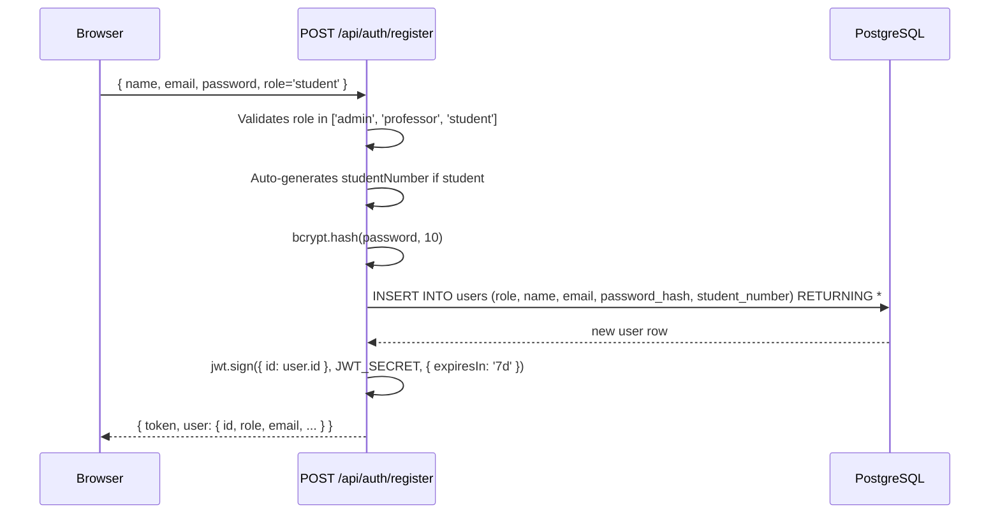
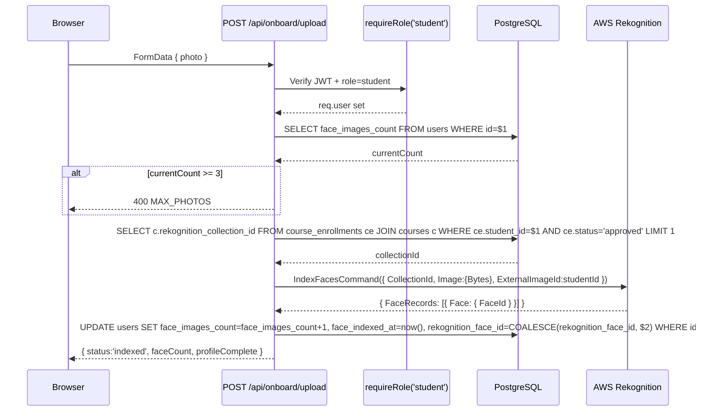
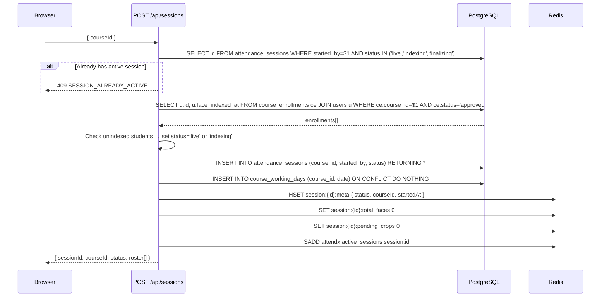
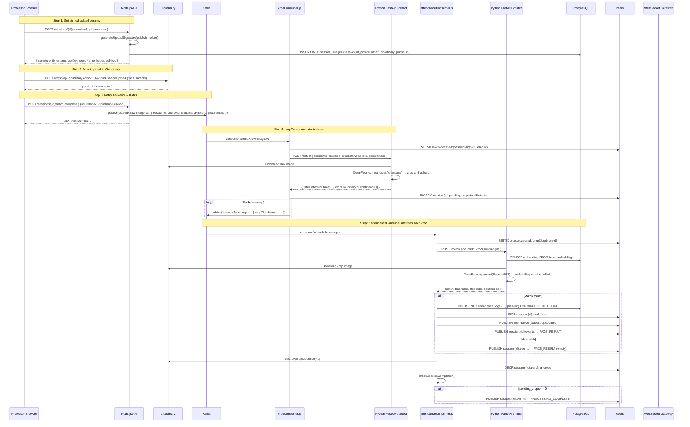
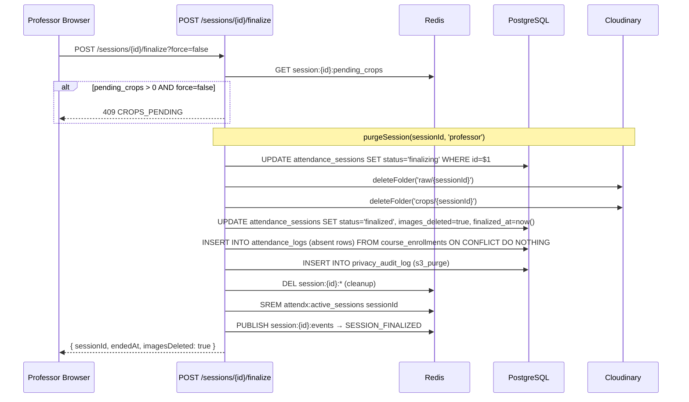
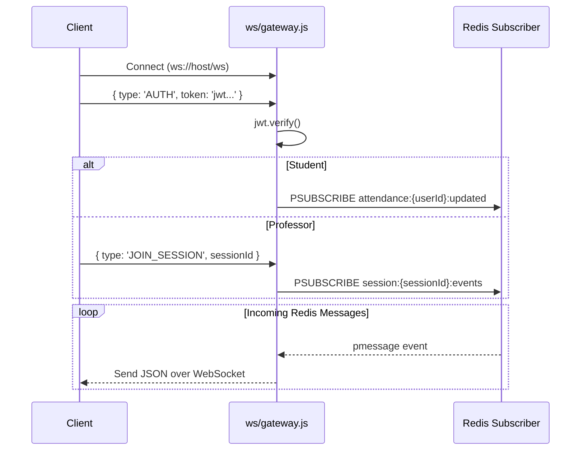
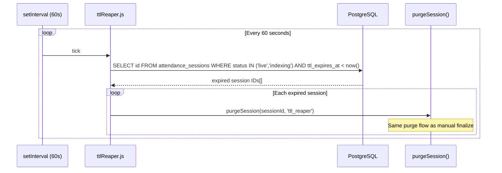

# AttendX — Reverse-Engineered Architecture & UML Diagrams

> Every element in these diagrams is traced to actual source code. Nothing is invented.
> **Face matching assumes the AWS Rekognition path** as requested.

---

## 1. System Understanding

| Aspect | Actual Implementation |
|---|---|
| **Frontend** | React 18 + Vite + Tailwind CSS. SPA with role-based routing (`App.jsx`). |
| **Backend API** | Node.js + Express.js (single process, port 3001). REST API + WebSocket gateway. |
| **Database** | PostgreSQL 16 (via `pg` Pool). 11 tables + 4 ENUMs. |
| **Cache / Pub-Sub** | Redis 7 (ioredis). Used for session state, idempotency locks (`SETNX`), counters (`pending_crops`, `total_faces`), active session set, and Pub/Sub event channels. |
| **Message Queue** | Kafka (KafkaJS). 3 topics: `attendx.raw-image.v1`, `attendx.face-crop.v1`, `attendx.face-match-dlq.v1`. |
| **Image Storage** | Cloudinary. Raw photos in `raw/{sessionId}/`, crops in `crops/{sessionId}/`. |
| **Face Recognition (AWS)** | AWS Rekognition `IndexFaces` (onboarding) and `SearchFacesByImage` (matching). Collections per course. |
| **Face Recognition (Local)** | Python FastAPI + DeepFace (Facenet512 + RetinaFace). Endpoints: `/index`, `/detect`, `/match`. |
| **WebSockets** | `ws` library. Path `/ws`. JWT auth. Professor subscribes to `session:{id}:events`. Student subscribes to `attendance:{userId}:updated`. |
| **Auth** | JWT (7-day expiry). `bcryptjs` password hashing. Middleware: `requireAuth`, `requireRole`. |
| **Roles** | `super_admin`, `admin`, `professor`, `student`. |
| **Background Workers** | `cropConsumer` (Kafka→detect), `attendanceConsumer` (Kafka→match), `bulkWriter` (Redis→DB, vestigial), `ttlReaper` (expires sessions). All started in-process from `server.js`. |

---

## 2. Workflow Analysis

| Workflow | Entry Point | Actual Flow | Database Tables | External Services | Result |
|---|---|---|---|---|---|
| **Student Signup** | `POST /api/auth/register` | Validate role → auto-gen student number → insert user → sign JWT | `users` | — | JWT + user object |
| **Login** | `POST /api/auth/login` | Lookup user → bcrypt compare → sign JWT | `users` | — | JWT + user object |
| **Face Onboarding (AWS)** | `POST /api/onboard/upload` | Guard max 3 → get course collection_id → `IndexFacesCommand` → update user | `users`, `course_enrollments`, `courses` | AWS Rekognition | `{ indexed, faceCount }` |
| **Create Course** | `POST /api/courses` | Generate collection ID → `CreateCollectionCommand` (if AWS) → insert course | `courses` | AWS Rekognition | Course object |
| **Enroll in Course** | `POST /api/courses/:id/enroll` | Verify institution match → insert enrollment (status=pending) | `course_enrollments`, `courses` | — | Enrollment row |
| **Approve Enrollment** | `POST /api/courses/:courseId/approve` | Update status to approved | `course_enrollments` | — | Updated status |
| **Start Session** | `POST /api/sessions` | Guard no duplicate → check indexing → insert session → seed Redis → return roster | `attendance_sessions`, `course_enrollments`, `users`, `course_working_days` | Redis | Session + roster |
| **Upload Photo** | `POST /sessions/:id/upload-url` → Cloudinary → `POST /sessions/:id/batch-complete` | Generate signed params → frontend uploads to Cloudinary → backend publishes Kafka | `session_images`, `attendance_sessions` | Cloudinary, Kafka | `{ queued: true }` |
| **Face Detection** | Kafka `attendx.raw-image.v1` → `cropConsumer.js` | Idempotency check → call Python `/detect` → seed `pending_crops` → publish per-crop to Kafka | — | Python FastAPI, Cloudinary, Redis, Kafka | Crop messages published |
| **Face Matching** | Kafka `attendx.face-crop.v1` → `attendanceConsumer.js` | Idempotency check → call Python `/match` → upsert attendance → notify via Redis Pub/Sub → delete crop → decrement counter | `attendance_logs` | Python FastAPI, Cloudinary, Redis | Attendance marked + WS push |
| **Manual Override** | `POST /courses/:id/attendance/:studentId` | Upsert manual_attendance | `manual_attendance` | Redis | Updated status + WS Push |
| **Finalize Session** | `POST /sessions/:id/finalize` | Check pending_crops → purge Cloudinary → insert absent rows → audit log → clean Redis → WS notify | `attendance_sessions`, `attendance_logs`, `course_enrollments`, `privacy_audit_log` | Cloudinary, Redis | Session finalized |
| **TTL Expiry** | `ttlReaper` (every 60s) | Query expired sessions → call `purgeSession` | `attendance_sessions` | Cloudinary, Redis | Expired sessions cleaned |
| **Admin: Manage Keys** | `POST /api/admin/keys` | Generate ATX-XXXX-XXXX keys → bulk insert | `registration_keys` | — | Key objects |

---

## 3. Actual Class Diagram

This diagram represents the **actual database models (PostgreSQL tables)**, the **actual Node.js modules** (Express routes, workers, middleware), and the **actual Python FastAPI endpoints** as they exist in the code. This project does NOT use generic OOP classes/services/repositories on the backend — it uses functional Express route handlers and standalone worker functions.

```mermaid
classDiagram
    direction TB

    %% ═══════════════════════════════════════════════
    %% DATABASE TABLES (from schema.sql)
    %% ═══════════════════════════════════════════════

    class institutions {
        +UUID id PK
        +TEXT name
        +TEXT domain
        +BOOLEAN is_active
        +TIMESTAMPTZ created_at
    }

    class users {
        +UUID id PK
        +user_role role
        +TEXT name
        +CITEXT email UNIQUE
        +TEXT password_hash
        +TEXT student_number UNIQUE
        +UUID institution_id FK
        +TEXT rekognition_face_id
        +TIMESTAMPTZ face_indexed_at
        +INT face_images_count
        +TIMESTAMPTZ created_at
    }

    class face_embeddings {
        +UUID id PK
        +UUID student_id FK
        +JSONB embedding
        +TEXT model
        +TIMESTAMPTZ created_at
    }

    class courses {
        +UUID id PK
        +TEXT name
        +TEXT code
        +TEXT term
        +UUID professor_id FK
        +UUID institution_id FK
        +TEXT rekognition_collection_id
        +TIMESTAMPTZ created_at
    }

    class course_enrollments {
        +UUID id PK
        +UUID course_id FK
        +UUID student_id FK
        +enrollment_status status
        +TIMESTAMPTZ requested_at
        +TIMESTAMPTZ decided_at
    }

    class registration_keys {
        +UUID id PK
        +TEXT key UNIQUE
        +UUID institution_id FK
        +TEXT status
        +TIMESTAMPTZ expires_at
        +UUID used_by FK
        +TIMESTAMPTZ used_at
        +TIMESTAMPTZ created_at
    }

    class attendance_sessions {
        +UUID id PK
        +UUID course_id FK
        +UUID started_by FK
        +session_status status
        +TIMESTAMPTZ started_at
        +TIMESTAMPTZ finalized_at
        +BOOLEAN images_deleted
        +INT total_faces_detected
        +TIMESTAMPTZ ttl_expires_at
    }

    class session_images {
        +UUID id PK
        +UUID session_id FK
        +SMALLINT picture_index
        +TEXT cloudinary_public_id
        +TIMESTAMPTZ uploaded_at
        +TIMESTAMPTZ deleted_at
    }

    class attendance_logs {
        +UUID id PK
        +UUID session_id FK
        +UUID student_id FK
        +attendance_status status
        +NUMERIC confidence
        +TEXT source
        +SMALLINT matched_picture_index
        +TIMESTAMPTZ decided_at
    }

    class unidentified_faces {
        +UUID id PK
        +UUID session_id FK
        +TEXT crop_cloudinary_id
        +UUID best_guess_student_id FK
        +NUMERIC confidence
        +BOOLEAN resolved
        +UUID resolved_student_id FK
        +TIMESTAMPTZ created_at
    }

    class privacy_audit_log {
        +UUID id PK
        +UUID session_id FK
        +TEXT action
        +TEXT triggered_by
        +TIMESTAMPTZ occurred_at
    }

    class course_working_days {
        +UUID course_id FK~PK~
        +TEXT date ~PK~
    }

    class manual_attendance {
        +UUID course_id FK~PK~
        +UUID student_id FK~PK~
        +TEXT date ~PK~
        +attendance_status status
        +TEXT source
    }

    %% ═══════════════════════════════════════════════
    %% DB RELATIONSHIPS
    %% ═══════════════════════════════════════════════
    institutions "1" --> "*" users : institution_id
    institutions "1" --> "*" courses : institution_id
    institutions "1" --> "*" registration_keys : institution_id
    users "1" --> "*" face_embeddings : student_id
    users "1" --> "*" courses : professor_id
    users "1" --> "*" course_enrollments : student_id
    users "1" --> "*" attendance_sessions : started_by
    users "1" --> "*" attendance_logs : student_id
    users "1" --> "0..1" registration_keys : used_by
    courses "1" --> "*" course_enrollments : course_id
    courses "1" --> "*" attendance_sessions : course_id
    courses "1" --> "*" course_working_days : course_id
    courses "1" --> "*" manual_attendance : course_id
    attendance_sessions "1" --> "*" session_images : session_id
    attendance_sessions "1" --> "*" attendance_logs : session_id
    attendance_sessions "1" --> "*" unidentified_faces : session_id
    attendance_sessions "1" --> "*" privacy_audit_log : session_id

    %% ═══════════════════════════════════════════════
    %% FRONTEND SERVICES
    %% ═══════════════════════════════════════════════

    class apiClient {
        +axios instance (baseURL: /api)
        +interceptors (JWT injection, 401 logout)
    }

    class authService {
        +login()
        +register()
        +logout()
    }
    class adminService {
        +getMetrics()
        +getInstitution()
        +getProfessors()
        +createProfessor()
        +getStudents()
        +createStudent()
        +getKeys()
        +generateKeys()
    }
    class courseService {
        +getCourses()
        +getCourse()
        +createCourse()
        +deleteCourse()
        +getAttendance()
        +approveEnrollment()
        +denyEnrollment()
        +enrollInCourse()
        +manageWorkingDays()
    }
    class sessionService {
        +getActiveSession()
        +startSession()
        +getUploadUrl()
        +batchComplete()
        +finalizeSession()
        +overrideAttendance()
    }
    class onboardService {
        +uploadFacePhoto()
        +getStatus()
    }
    class studentService {
        +getProfile()
        +getInstitutions()
    }

    apiClient <|-- authService
    apiClient <|-- adminService
    apiClient <|-- courseService
    apiClient <|-- sessionService
    apiClient <|-- onboardService
    apiClient <|-- studentService

    %% ═══════════════════════════════════════════════
    %% NODE.JS MODULES (actual route files)
    %% ═══════════════════════════════════════════════

    class authRoutes {
        +POST_login()
        +POST_register()
        +POST_logout()
    }
    class onboardRoutes {
        +GET_status()
        +POST_upload()
    }
    class adminRoutes {
        +GET_metrics()
        +GET_professors()
        +POST_professors()
        +GET_students()
        +POST_students()
        +GET_keys()
        +POST_keys()
        +DELETE_keys_id()
    }
    class courseRoutes {
        +GET_list()
        +POST_create()
        +GET_detail()
        +DELETE_id()
        +POST_enroll()
        +POST_approve()
        +POST_deny()
        +POST_attendance_override()
        +POST_working_days()
    }
    class sessionRoutes {
        +GET_active()
        +POST_create()
        +GET_roster()
        +POST_upload_url()
        +POST_batch_complete()
        +PUT_attendance_override()
        +POST_finalize()
        +purgeSession()
    }

    class cropConsumer {
        +startCropConsumer()
        -handleMessage()
    }

    class attendanceConsumer {
        +startAttendanceConsumer()
        -handleMessage()
        -checkSessionCompletion()
    }
    
    class wsGateway {
        +setupWebSocket()
        +Redis pubsub listeners
    }

    %% Aligning frontend with backend logically
    authService ..> authRoutes : HTTP
    adminService ..> adminRoutes : HTTP
    courseService ..> courseRoutes : HTTP
    sessionService ..> sessionRoutes : HTTP
    onboardService ..> onboardRoutes : HTTP
```

---

## 4. Actual Use Case Diagram

Every use case below is backed by an actual route handler in the code.

```mermaid
graph TB
    subgraph "AttendX System"
        direction TB

        UC_LOGIN["Login"]
        UC_SIGNUP["Register / Sign Up"]
        
        UC_SA_LIST_INST["List Institutions"]
        UC_SA_CREATE_INST["Create Institution"]
        UC_SA_LIST_ADMINS["List Admins"]

        UC_A_METRICS["View Metrics Dashboard"]
        UC_A_LIST_PROF["List Professors"]
        UC_A_CREATE_PROF["Create Professor"]
        UC_A_LIST_STU["List Students"]
        UC_A_CREATE_STU["Create Student"]
        UC_A_LIST_KEYS["List Registration Keys"]
        UC_A_GEN_KEYS["Generate Keys"]

        UC_P_LIST_COURSES["List My Courses"]
        UC_P_CREATE_COURSE["Create Course"]
        UC_P_VIEW_COURSE["View Course & Roster"]
        UC_P_APPROVE_ENROLL["Approve/Deny Enrollment"]
        UC_P_MANAGE_WORKDAYS["Manage Working Days"]
        UC_P_START_SESSION["Start Attendance Session"]
        UC_P_GET_UPLOAD_URL["Get Cloudinary Upload URL"]
        UC_P_UPLOAD_PHOTO["Upload Classroom Photo"]
        UC_P_BATCH_COMPLETE["Trigger Batch Processing (Kafka)"]
        UC_P_MANUAL_OVERRIDE["Manual Attendance Override"]
        UC_P_FINALIZE["Finalize / End Session"]

        UC_S_UPLOAD_FACE["Upload Face Photo"]
        UC_S_ENROLL["Enroll in Course"]
        UC_S_VIEW_ATTEND["View My Attendance"]

        UC_SYS_CROP["Detect + Crop Faces (Kafka)"]
        UC_SYS_MATCH["Match Face (Kafka)"]
        UC_SYS_TTL["Auto-Expire Sessions"]
    end

    SUPER_ADMIN(["Super Admin"])
    ADMIN(["Admin"])
    PROFESSOR(["Professor"])
    STUDENT(["Student"])
    SYSTEM(["System / Background"])

    SUPER_ADMIN --- UC_LOGIN
    SUPER_ADMIN --- UC_SA_LIST_INST
    SUPER_ADMIN --- UC_SA_CREATE_INST
    SUPER_ADMIN --- UC_SA_LIST_ADMINS

    ADMIN --- UC_LOGIN
    ADMIN --- UC_A_METRICS
    ADMIN --- UC_A_LIST_PROF
    ADMIN --- UC_A_CREATE_PROF
    ADMIN --- UC_A_LIST_STU
    ADMIN --- UC_A_CREATE_STU
    ADMIN --- UC_A_LIST_KEYS
    ADMIN --- UC_A_GEN_KEYS

    PROFESSOR --- UC_LOGIN
    PROFESSOR --- UC_P_LIST_COURSES
    PROFESSOR --- UC_P_CREATE_COURSE
    PROFESSOR --- UC_P_VIEW_COURSE
    PROFESSOR --- UC_P_APPROVE_ENROLL
    PROFESSOR --- UC_P_MANAGE_WORKDAYS
    PROFESSOR --- UC_P_START_SESSION
    PROFESSOR --- UC_P_GET_UPLOAD_URL
    PROFESSOR --- UC_P_UPLOAD_PHOTO
    PROFESSOR --- UC_P_BATCH_COMPLETE
    PROFESSOR --- UC_P_MANUAL_OVERRIDE
    PROFESSOR --- UC_P_FINALIZE

    STUDENT --- UC_LOGIN
    STUDENT --- UC_SIGNUP
    STUDENT --- UC_S_UPLOAD_FACE
    STUDENT --- UC_S_ENROLL
    STUDENT --- UC_S_VIEW_ATTEND

    UC_P_BATCH_COMPLETE -.->|"<<include>>"| UC_SYS_CROP
    UC_SYS_CROP -.->|"<<include>>"| UC_SYS_MATCH

    SYSTEM --- UC_SYS_TTL
```

---

## 5. Actual Sequence Diagrams

### 5.1 Student Signup

### 5.2 Face Onboarding (AWS Rekognition Path)

### 5.3 Start Attendance Session

### 5.4 Photo Upload → Face Detection → Matching (Core Pipeline)

### 5.5 Finalize Session

### 5.6 WebSocket Gateway (Real-Time PubSub)

### 5.7 TTL Reaper (Auto-Expiry)

---

## 6. Traceability Map

| Component | Source File(s) / DB Objects |
|---|---|
| **Tables** | `src/db/schema.sql` (all tables and enums), `src/db/migrate_*.sql` |
| **Admin Endpoints** | `src/routes/admin.js`, `src/routes/superadmin.js`, `frontend/src/services/adminService.js`, `superAdminService.js` |
| **Auth Endpoints** | `src/routes/auth.js`, `src/middleware/auth.js`, `frontend/src/services/authService.js` |
| **Course Mgmt** | `src/routes/courses.js`, `frontend/src/services/courseService.js` |
| **Session Mgmt** | `src/routes/sessions.js`, `frontend/src/services/sessionService.js` |
| **Onboarding** | `src/routes/onboard.js`, `frontend/src/services/onboardService.js` |
| **Workers** | `src/workers/cropConsumer.js`, `src/workers/attendanceConsumer.js`, `src/workers/ttlReaper.js` |
| **Python Side** | `workers/cropper_worker.py`, `workers/matcher_worker.py` (Local fallback paths) |
| **Sockets** | `src/ws/gateway.js`, `frontend/src/hooks/useRecognitionSocket.js`, `useAttendanceSocket.js` |
| **DB & Infra** | `src/db/pool.js`, `src/kafka/producer.js`, `src/redis/client.js`, `src/utils/cloudinary.js` |
